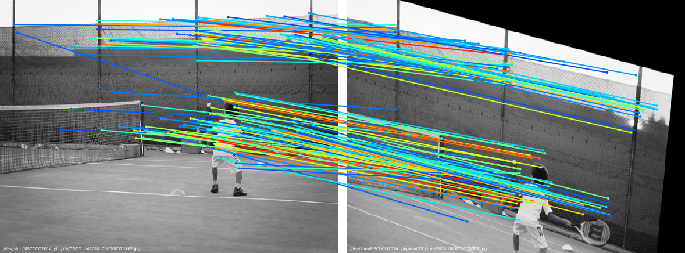

# SuperGlue-pytorch training

adapted from: https://github.com/HeatherJiaZG/SuperGlue-pytorch

1、based on official superpoint implementation

2、enable training batchsize > 1

3、loss forward speed 10x accelerated 

4、enable training-set non-linear warping

5、negative pairs in training-set

6、enable offline data generation

## offline building training-set (recommend): 

python -m dataset.data_builder --debug 1

## training: 

python train.py --train_path {train_path} --superpoint_weight ./models/weights/superpoint_v1.pth --feature_dim 256 --dataset_offline_rebuild 1 --pretrained "" --batch_size 32 --debug 0

--------------------------------------------------------------

# SuperGlue PyTorch Implementation

* Full paper PDF: [SuperGlue: Learning Feature Matching with Graph Neural Networks](https://arxiv.org/abs/1911.11763).

## Dependencies
* Python 3
* PyTorch >= 1.1
* OpenCV >= 3.4 (4.1.2.30 recommended for best GUI keyboard interaction, see this [note](#additional-notes))
* Matplotlib >= 3.1
* NumPy >= 1.18
* tensorboardX >= 2.1

## Contents
There are two main top-level scripts in this repo:

1. `train.py` : trains the superglue model.
2. `load_data.py`: reads images from files and creates pairs. It generates keypoints, descriptors and ground truth matches which will be used in training.

### Additional useful command line parameters
* Use `--epoch` to set the number of epochs (default: `20`).
* Use `--train_path` to set the path to the directory of training images.
* Use `--eval_output_dir` to set the path to the directory in which the visualizations is written (default: `dump_match_pairs/`).
* Use `--show_keypoints` to visualize the detected keypoints (default: `False`).
* Use `--viz_extension` to set the visualization file extension (default: `png`). Use pdf for highest-quality.

### Visualization Demo
The matches are colored by their predicted confidence in a jet colormap (Red: more confident, Blue: less confident).

